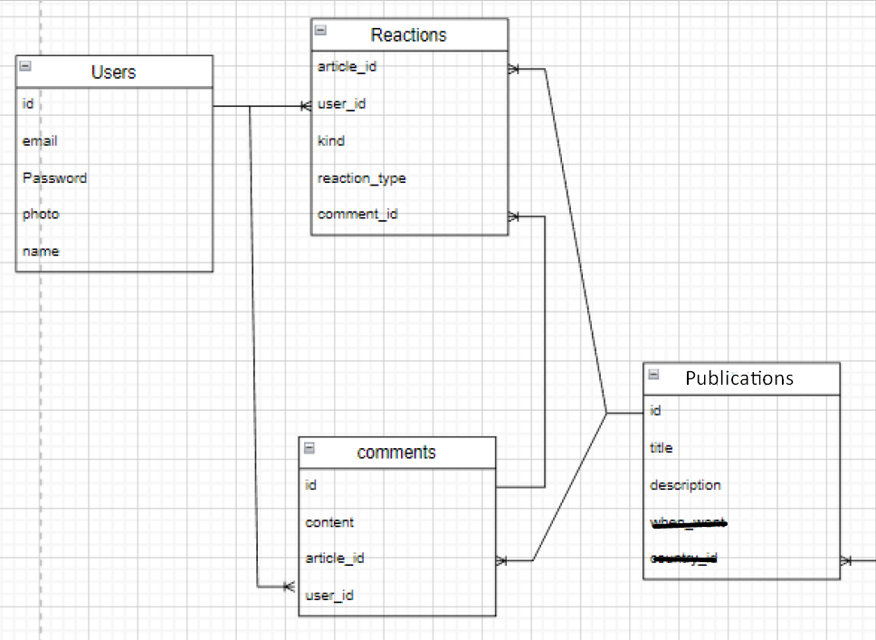

# README

## Descripción
Marcelo se encuentra con poca carga laboral, desde que los terremotos ya no se repiten con
tanta frecuencia, nadie lo llama para hablar de ellos. Por esto, se ha decidido a dedicar todo
su tiempo libre en su verdadera pasión, los gatos. Marcelo se ha acercado a nosotros con la
finalidad de crear una aplicación para todos los locos por los gatos como él, llamada
Crazy4Cats.
Marcelo busca poder publicar sus aventuras con sus gatos y espera que todos sus usuarios
puedan hacer lo mismo, podrán dar Me gusta o no me gusta a cada publicación que se suba
a la página web. Los comentarios pueden ser anónimos como hechos por un usuario. Por
último, solicita poder entrar el de cualquier ubicación, dado que viaja mucho por su trabajo
para poder revisar avances de la primera entrega.
Aplicando los conceptos y herramientas aprendidas hasta ahora, debes crear una
plataforma que pueda atender esta solicitud.
*
* publicar sus aventuras (publicaciones)
* dar Me gusta (reacciones)
* comentarios pueden ser anónimos (comentarios)
* usuario (Devise)
* datos de prueba (Faker)

## Requerimientos
* 1. Set-up inicial del proyecto con sus relaciones y modelos. (2 Puntos)
* 2. La aplicación debe tener todas sus vistas bien estilizadas y con diseño agradable. (2 Puntos)
* 3. Implementar reacciones de un usuario a las publicaciones. (2 Puntos)
* 4. Implementar comentarios para las publicaciones. (2 Puntos)
* 5. Realizar deploy a Heroku con datos ficticios. (2 puntos)

### Implementacion
* rails new Crazy4Cats -d postgresql && cd Crazy4Cats
* Configurar el archivo config/database.yml
* rails db:create
* gem 'devise'
* bundle install
* rails generate devise:install
* config/environments/development.rb
 config.action_mailer.default_url_options = { host: 'localhost', port: 3000 }
* rails g devise:views
* rails generate devise user photo name
* rails db:migrate db:migrate:status
* rails g scaffold Publications title description 

* rails g model comment content publication:references user:references
* rails g model reaction kind reaction_type publication:references user:references comment:references
* rails db:migrate db:migrate:status
* gem 'faker'
* bundle install

* rails s -b 0.0.0.0
* rails g controller reactions
* rails g controller comments
* rails db:seed